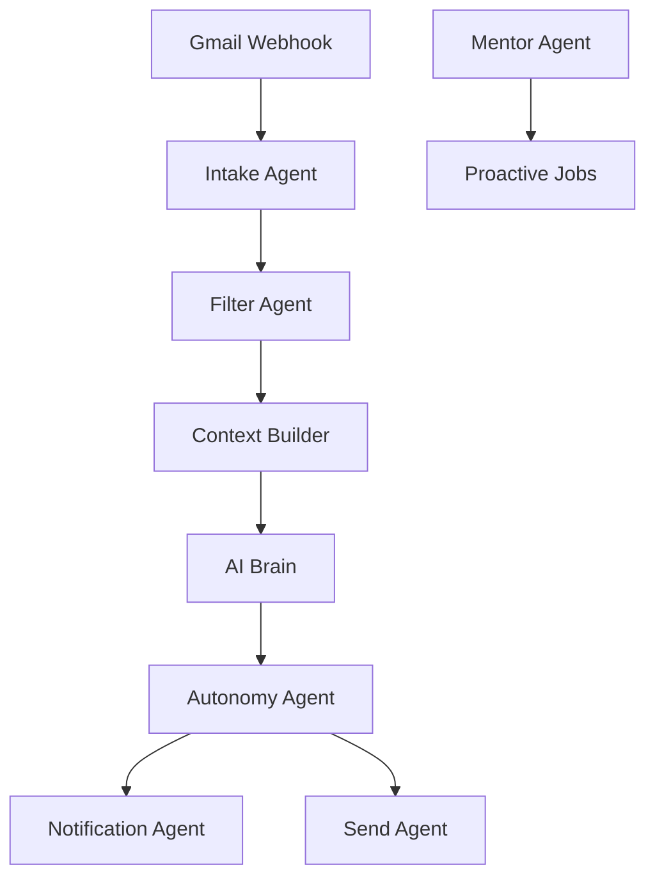

# ⚡ Velox — AI Autonomous Email Copilot

[](https://github.com/SanthaKumar-K-2004)
[](https://opensource.org/licenses/MIT)
[](https://nodejs.org/)

**Velox** is a high-performance, multi-agent AI system designed to transform your inbox into an automated productivity engine. Built with **10 specialized intelligent agents**, Velox doesn't just filter emails—it understands your tone, learns your preferences, and handles your communication autonomously.

---

## 🚀 Key Features

### 🧠 Multi-Agent Orchestration
Velox utilizes a "Brain" of 10 coordinated agents:
- **Intake Agent:** Deduplicates and locks incoming streams.
- **Filter Agent:** Real-time classification (Urgent, Promo, Trash, AI-Required).
- **Context Builder:** Tiered memory injection (Core, Contact, Topic).
- **AI Brain:** High-reasoning analysis powered by Gemini 2.0.
- **Autonomy Agent:** Decides between immediate notification, drafting, or auto-sending.
- **Vault Agent:** Extracts and indexes document metadata for search.
- **Mentor Agent:** Proactive morning digests, spam rescue, and health monitoring.
- **Memory Agent:** Learns your writing style and detects "tone drift".

### 📧 Multi-Account Support
Seamlessly connect and manage multiple Gmail accounts under a single Velox instance. Each account maintains its own context, history, and automation rules.

### 📱 Telegram Command Center
Control your entire email life from Telegram.
- `/inbox` — View what needs attention.
- `/pending` — Approve or edit drafts.
- `/vault` — Retrieve stored receipts and docs.
- `/away` — Activate holiday automated mode.

---

## 🛠️ Technology Stack

- **Runtime:** Node.js (ESM)
- **AI Engine:** Google Gemini (Generative AI)
- **Database:** Supabase (PostgreSQL)
- **Messaging:** Telegram Bot API
- **Deployment:** Render.com & Google Apps Script

---

## 🔧 Quick Start

### 1. Prerequisites
- Node.js 18+
- Supabase Project & Service Key
- Google Cloud Project (OAuth2 enabled)
- Telegram Bot Token (via @BotFather)

### 2. Testing & Verification
For a step-by-step guide on how to verify your setup, see [TESTING_GUIDE.md](TESTING_GUIDE.md).

### 3. Installation
```bash
git clone https://github.com/SanthaKumar-K-2004/Velox.git
cd Velox
npm install
```

### 3. Environment Setup
Create a `.env` file:
```env
SUPABASE_URL=your_supabase_url
SUPABASE_SERVICE_KEY=your_service_key
GEMINI_API_KEY=your_gemini_key
TELEGRAM_BOT_TOKEN=your_bot_token
GOOGLE_CLIENT_ID=your_client_id
GOOGLE_CLIENT_SECRET=your_client_secret
GOOGLE_REDIRECT_URI=https://your-domain.com/auth/google/callback
WEBHOOK_SECRET=your_secure_secret
```

### 4. Database Setup
```bash
npm run setup
```

---

## 🏛️ Architecture



---

## 🎖️ Presentation

Presented with ❤️ by **AlphaXSolutions**.

---

## 📄 License

This project is licensed under the MIT License - see the [LICENSE](LICENSE) file for details.
